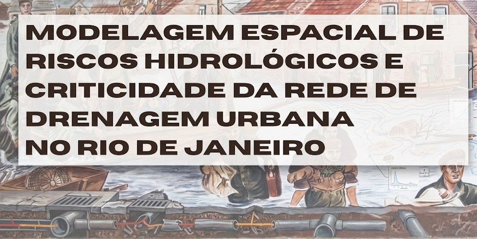
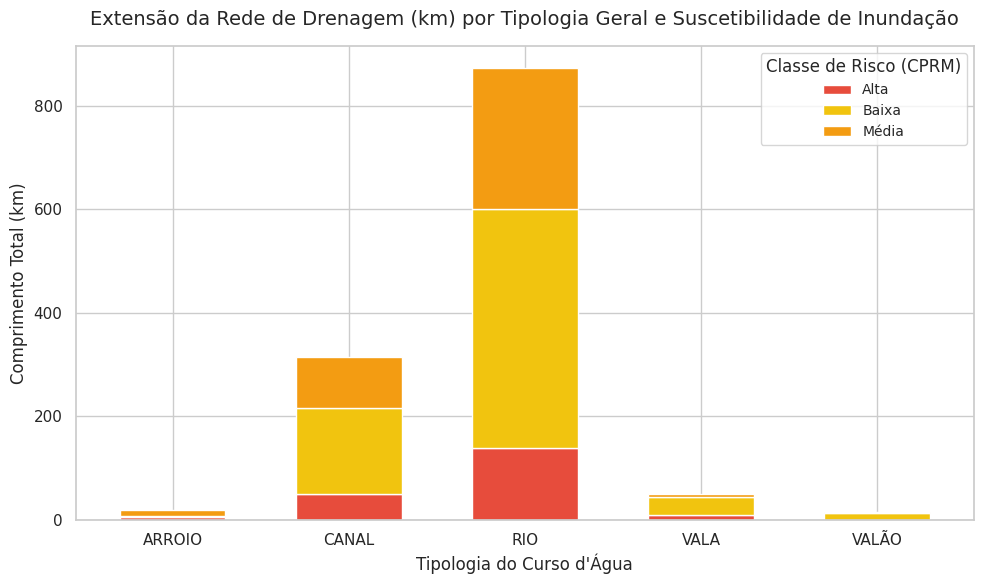
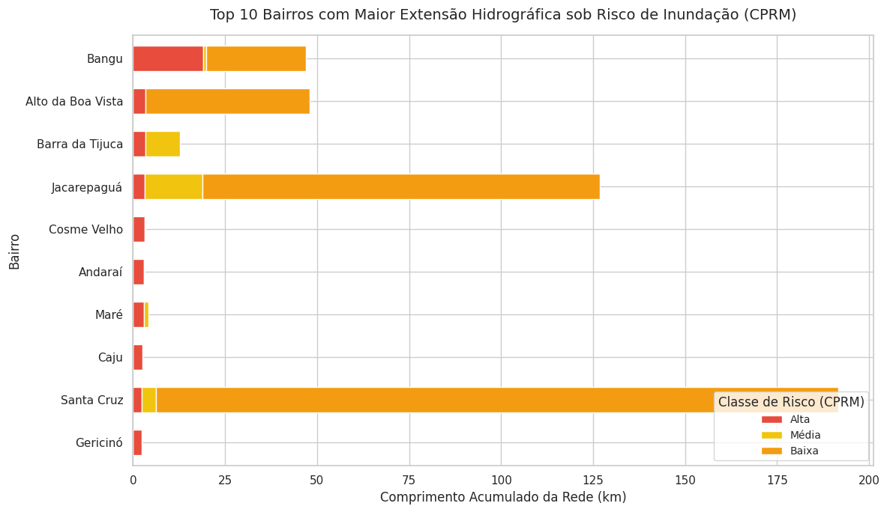
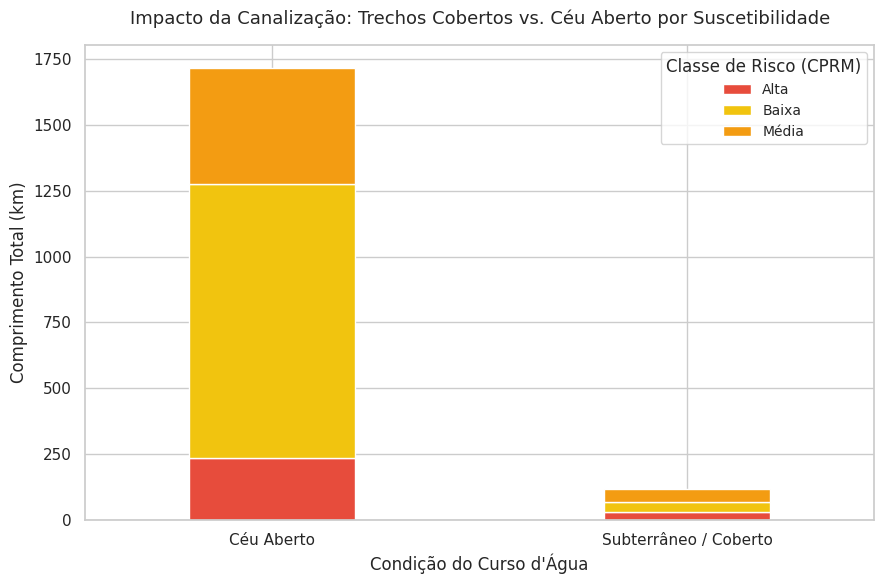

## Sobre o Projeto
Apresentação de uma abordagem integrada de análise espacial e mitigação de desastres climáticos aplicada à gestão de riscos hidrológicos no município do Rio de Janeiro. 

A metodologia consistiu no cruzamento espacial de camadas ve (via Sistemas de Informação Geográfica - SIG) entre a camada vetorial da **Rede Hidrográfica Municipal** [1](https://siurb.rio/portal/apps/experiencebuilder/experience/?id=69d735eb4b5c4cf781fe32d5153f8c2e) e o mapeamento de **Suscetibilidade à Inundação**, [2](https://siurb.rio/portal/apps/experiencebuilder/experience/?id=69d735eb4b5c4cf781fe32d5153f8c2e) desenvolvido pela **CPRM (Serviço Geológico do Brasil)** e disponibilizados no portal SMAC MAPAS.[3](https://siurb.rio/portal/apps/experiencebuilder/experience/?id=69d735eb4b5c4cf781fe32d5153f8c2e)

O objetivo principal foi quantificar a vulnerabilidade física da infraestrutura de macrodrenagem urbana frente a cenários de risco hidrológico, estruturando a investigação em três análises complementares:

1. **Vulnerabilidade por Tipologia Hidrográfica:** Quantificação do nível de exposição ao risco (Alta, Média e Baixa Suscetibilidade) para cada tipologia de curso d'água (Rios, Canais, Arroios, Valas e Valões).
2. **Análise de Vulnerabilidade Local (Top 10 Bairros Críticos):** Identificação e espacialização das regiões administrativas com maior extensão linear de drenagem sob criticidade máxima (Alta Suscetibilidade), isolando gargalos territoriais prioritários para investimento público.
3. **Impacto da Canalização (Canais Cobertos vs. Céu Aberto):** Diagnóstico de engenharia urbana focado na comparação de resiliência hidráulica entre trechos em calha natural e galerias subterrâneas artificiais (tamponadas).

*Infraestrutura de Dados Espaciais (IDE)* Devido à ausência de botões de download direto para as bases vetoriais nos portais de origem, foi realizada a extração das URLs dos servidores de mapas oficiais através da análise de requisições de rede. As camadas foram consumidas via conexão nativa WMS/WFS diretamente no ambiente SIG (QGIS), garantindo a integridade e a procedência oficial dos dados consultados.

---

## Tecnologias e Ferramentas Utilizadas
* **QGIS:** Processamento digital de dados vetoriais, operações de interseção espacial e refinamento da base cartográfica.
* **Python (Google Colab):** Tratamento, limpeza de dados textuais estruturados e criaçao de novas variaáveis analiticas com `Pandas`.
* **Matplotlib & Seaborn:** Geração de gráficos estatísticos e estilização de matrizes de criticidade.

---

## Matriz de Criticidade

A tabela abaixo sintetiza a extensão linear (em quilômetros) e a distribuição percentual de cada tipologia de drenagem frente às classes de suscetibilidade mapeadas:

| Tipologia do Curso d'Água | Alta Suscetibilidade (km) | Alta (%) | Média Suscetibilidade (km) | Média (%) | Baixa Suscetibilidade (km) | Baixa (%) | Extensão Total (km) |
| :--- | :---: | :---: | :---: | :---: | :---: | :---: | :---: |
| **ARROIO** | 5,43 | 29,74% | 10,10 | 55,31% | 2,73 | 14,95% | **18,26** |
| **CANAL** | 48,85 | 15,51% | 98,06 | 31,13% | 168,09 | 53,36% | **315,00** |
| **RIO** | 139,03 | 15,93% | 272,67 | 31,25% | 460,93 | 52,82% | **872,63** |
| **VALA** | 9,04 | 18,16% | 5,91 | 11,87% | 34,83 | 69,97% | **49,78** |
| **VALÃO** | 0,00 | 0,00% | 0,99 | 6,61% | 13,98 | 93,39% | **14,97** |

---

## Visualização dos Dados

---

## Principais Insights Técnicos

* **Pressão Absoluta nos Rios Naturais:** Embora a classe de Alta Suscetibilidade represente cerca de 15,93% da malha dos **Rios**, esse percentual equivale a  **139,03 km** de leitos fluviais correndo sob risco máximo de transbordo urbano, evidenciando o severo adensamento sobre as planícies de inundação naturais (MIRANDA, 2016) 
* **Gargalos de Engenharia nos Canais:** Os **Canais** artificiais somam **48,85 km** em zonas de Alta Suscetibilidade e **98,06 km** em áreas Médias. Praticamente metade (46,64%) de toda a estrutura de engenharia cinza construída para retificação fluviométrica encontra-se em zonas propensas a colapsos micro e macro-hidráulicos.
* **Vulnerabilidade Proporcional dos Arroios:** A tipologia **Arroio** revelou-se a mais sufocada da malha urbana, com **85,05%** de sua extensão total classificada entre Média e Alta Suscetibilidade (55,31% e 29,74%), atuando como os primeiros indicadores de saturação hídrica das bacias.

---

## Diretrizes e Soluções Propostas

Os dados quantitativos robustecem a necessidade de uma transição nos modelos tradicionais de drenagem urbana voltados para a engenharia cinza (canalizações fechadas e concretadas). Como direcionamento técnico, proponho:
1. Adoção de **Soluções Baseadas na Natureza (SBN)** para recuperação da capacidade de infiltração natural do solo urbano [Artigo 1](https://www.scielo.br/j/urbe/a/54jTFvySqRCgzkwZ44bJj6M/?format=html&lang=pt)
2. Implantação de bacias de amortecimento de cheias e **Parques Lineares Urbanos** integrados [Artigo 2](https://repositorio.ufc.br/handle/riufc/59019) 
3. Restauração e fiscalização rígida das **Faixas Marginais de Proteção (FMP)** nos trechos identificados sob Alta Suscetibilidade 

---
### 🏙️ Análise de Vulnerabilidade Local (Top 10 Bairros Críticos)

Ao cruzar a malha hidrográfica fragmentada com as regiões administrativas, o modelo isolou os 10 bairros do município do Rio de Janeiro que concentram a maior extensão linear de drenagem sob **Alta Suscetibilidade** à inundação. 
| Bairro | Alta Suscetibilidade (km) | Média Suscetibilidade (km) | Baixa Suscetibilidade (km) | Extensão Total (km) |
| :--- | :---: | :---: | :---: | :---: |
| **Bangu** | 18,97 | 0,87 | 27,08 | **46,92** |
| **Alto da Boa Vista** | 3,48 | 0,00 | 44,58 | **48,06** |
| **Barra da Tijuca** | 3,43 | 9,30 | 0,00 | **12,73** |
| **Jacarepaguá** | 3,20 | 15,62 | 107,95 | **126,77** |
| **Cosme Velho** | 3,15 | 0,30 | 0,00 | **3,45** |
| **Andaraí** | 3,05 | 0,09 | 0,00 | **3,14** |
| **Maré** | 2,90 | 1,38 | 0,00 | **4,28** |
| **Caju** | 2,53 | 0,00 | 0,00 | **2,53** |
| **Santa Cruz** | 2,44 | 3,87 | 185,36 | **191,67** |
| **Gericinó** | 2,43 | 0,00 | 0,00 | **2,43** |

Essa análise espacial permite o direcionamento assertivo de recursos públicos e priorização de obras de manejo de águas pluviais.

## Visualização dos Dados por Bairro

## 🔬 Insights Territoriais do Diagnóstico

*Vetor de Risco na Zona Oeste (Bangu):* O bairro de Bangu concentra a maior extensão crítica do município, com 18,97 km de drenagem sob alta suscetibilidade. A topografia local de vale, somada ao rápido adensamento urbano, torna a bacia do Rio Sarapuí e seus afluentes a zona mais vulnerável a transbordamentos imediatos.

*Margem Nula de Escoamento (Cosme Velho, Andaraí, Caju e Gericinó):* Embora tenham extensões totais menores, esses distritos apresentam cenários críticos porque quase 100% de suas calhas (com médias entre 2,4 km e 3,1 km) estão espremidas em áreas de média a alta suscetibilidade. Não há margem natural de amortecimento para cheias nessas sub-bacias.

*Falso Conforto nas Baixadas (Santa Cruz e Jacarepaguá):* Estes bairros lideram em extensão total de rios (com 185,36 km e 107,95 km respectivamente), concentrando grandes trechos em "Baixa Suscetibilidade" devido ao relevo plano das planícies costeiras. Contudo, por serem zonas de deságue final, esses trechos planos sofrem influência direta de marés e retenção de sedimentos, exigindo preservação rígida das Faixas Marginais de Proteção (FMP).

### Análise de Engenharia Urbana: Canais Cobertos vs. Céu Aberto

Esta análise investiga o impacto do modelo tradicional de engenharia cinza (tamponamento e fechamento de cursos d'água em galerias subterrâneas) frente às manchas de inundação. O objetivo foi quantificar se a ocultação da rede de drenagem mitigou ou concentrou os fatores de risco socioambiental no município.

| Condição do Curso d'Água | Alta Suscetibilidade (km) | Média Suscetibilidade (km) | Baixa Suscetibilidade (km) | Extensão Total (km) |
| :--- | :---: | :---: | :---: | :---: |
| **Céu Aberto** | 234,78 | 441,58 | 1040,61 | **1716,97** |
| **Subterrâneo / Coberto** | 30,19 | 49,71 | 35,68 | **115,58** |

---

## Visualização do Impacto da Canalização

---

## 🔬 Insights de Infraestrutura Urbana

## Dinâmica de Drenagem: Canais Cobertos vs. Calha Aberta
Relação de Risco em Galerias Subterrâneas: Dos 115,58 km de rede hidrográfica canalizada e subterrânea, 69,12% (79,90 km) estão situados em áreas de média a alta suscetibilidade à inundação. Esse dado evidencia as limitações hidráulicas do sistema de micro e macrodrenagem convencional (galerias fechadas) em absorver picos de vazão em eventos extremos de precipitação urbana.

Capacidade de Amortecimento em Calha Aberta: Embora a rede a céu aberto concentre o maior valor absoluto sob alta suscetibilidade (234,78 km), a maior parte de sua extensão total (60,60%) permanece em zonas de baixa suscetibilidade. Essa configuração territorial indica um cenário favorável para a aplicação de Soluções Baseadas na Natureza (SBN), utilizando as calhas abertas para criar bacias de retenção e faixas de amortecimento antes do estrangulamento da drenagem nas áreas adensadas.
  
## Autor
* **Vitória B. B. de Carvalho** - Bióloga e Analista Ambiental 
* [LinkedIn](https://www.linkedin.com/in/vitoria-b-b-de-carvalho/)
* [E-mail](mailto:vibbarcellos@gmail.com)
